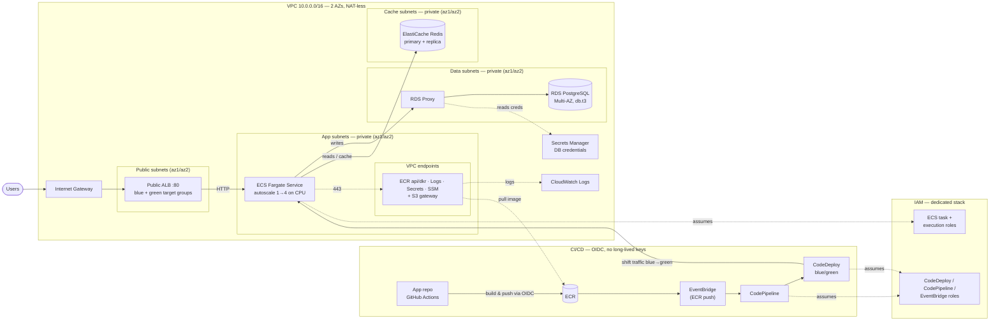

# Architecture (Mermaid)

> The RDS Proxy role stays in the data stack (its policy needs the
> auto-generated DB secret ARN) and the GitHub OIDC roles live in the bootstrap
> stack; every other service role is centralized in the **iam** stack.

## Security group matrix (least privilege)

| Source | Destination | Port | Purpose |
|--------|-------------|------|---------|
| Internet | ALB SG | 80 | Public HTTP |
| ALB SG | ECS SG | 8080 | Forward + health checks |
| ECS SG | RDS Proxy SG | 5432 | DB writes via proxy |
| ECS SG | Redis SG | 6379 | Cache reads/writes |
| ECS SG | Endpoints SG | 443 | ECR/Logs/Secrets/SSM |
| ECS SG | S3 prefix list | 443 | ECR image layers (S3 gw) |
| RDS Proxy SG | RDS SG | 5432 | Proxy → instance |
| VPC CIDR | Endpoints SG | 443 | Interface endpoints |

Every other path is denied by default. RDS accepts traffic **only** from the
RDS Proxy SG; Redis accepts traffic **only** from the ECS SG.
